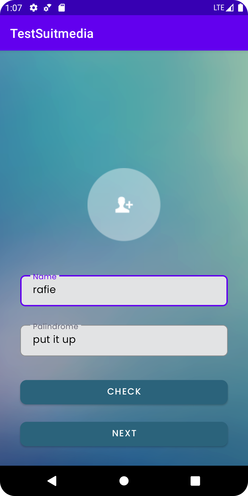

# TestSuitmedia
this project is created to fulfill test from Suitmedia


## Screenshots

<p align="center">
  
  
  
</p>

<p align="center">
  
  
</p>

## Installation
#### 1. download file APK in https://github.com/rafiechautie/TestSuitmedia/blob/master/app-debug.apk
### 2. install that file in your mobile phone


or you can use clone this project

#### 1. Clone this Project to your Computer
```bash
git clone https://github.com/rafiechautie/TestSuitmedia.git

